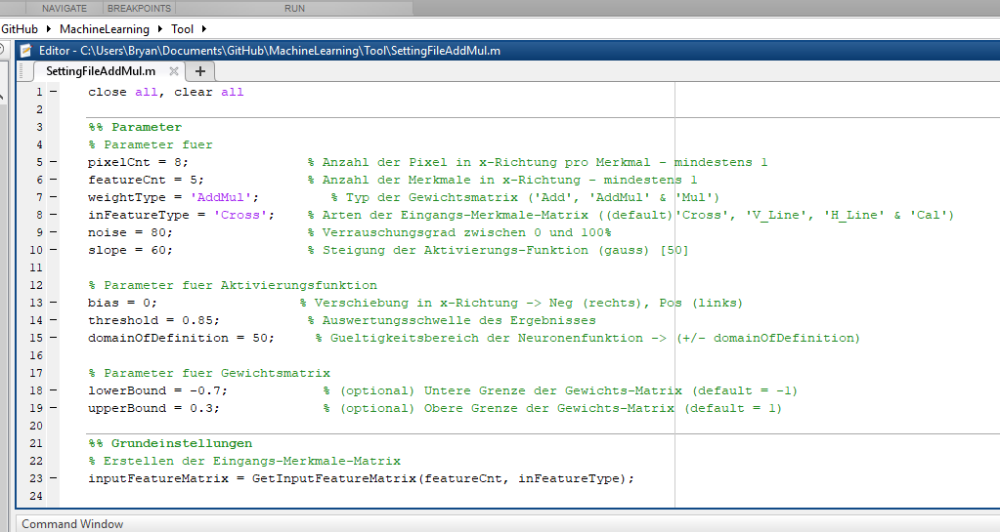
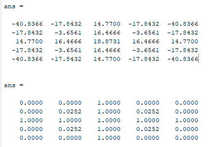
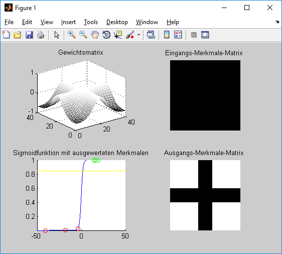
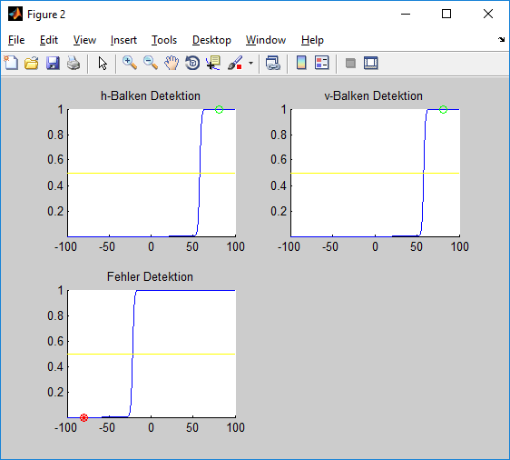

---
export_on_save:
    html: true
---

[Besprechung vom 24.04.2020](#besprechung-1)

# Besprechung 1

+ Erstes Ziel: Blockschaltbild erstellen mit Zahlenbereichen  

+ lowerBound und upperBound müssten in HW eher zwischen -0,75 und 0,25. Wir lassen es ersteinmal so (-0,7 bis 0,3), um später eine Optimierung zu haben.
  

+ Zahlenbereiche für Neuronen Ebende
 
 
 

 + Gewichtsmatrix ([Link zur Textdatei](./Bilder/myData.txt))
    ```
    G = table(weightMatrix)
    writetable(G,'myData.txt','Delimiter',';')
    ```  
      
+ wichtige Parameter für die HW- Simulation
    - Pixel Count
    - Feature Count
    - Gewichtsmatrix
    - (Bias) -> Toni sagt "NEIN!"
        * h-Balken
        * v-Balken
        * Fehler Detektion
    - Threshold (3. Ebene) -> Balkenausgabe
        * h-Balken
        * v-Balken
        * Fehler Detektion

$\frac{n!}{\frac{k!(n-k)!}{3}}$

    

+ Nächsten Ziele:
    + Blockschaltbild für seriellen Ablauf aus Sicht eines Merkmals (@Toni): 3 3 Merkmale (3 3 Pixel) -> wie Bryan und einmal als Ablaufdiagramm
    + wie funktioniert ein float, SW / HW (@Toni und Bryan)
    + definierte Schnittstelle (Vor-Simulation -> HW-Simulation)  (@Bryan)
        - 2 Funktionen für jede Simulation
        
+ weitere Ziele:
    + Simulation für Hardware
        + HW - Neuron, erstmal mit großem integer Zahlenwert (@Bryan)
        + Gewichtmatrix aus Textdatei einlesen
        + Umwandlung von float in integer (fixpoint)
    + Funktion für Zahlenbereichsoptimierung
    + simuliertes Hardware-Neuron
        - Addierer
        - Multiplizierer
        - Größe Summe des Ausgangs -> Zweierpotenz
    + automatische Optimierung der Gewichte auf eines Zahlenbereich